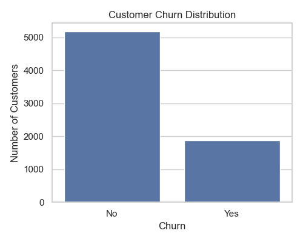
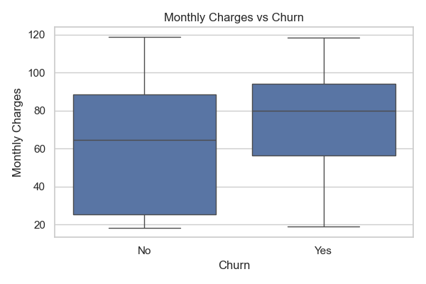
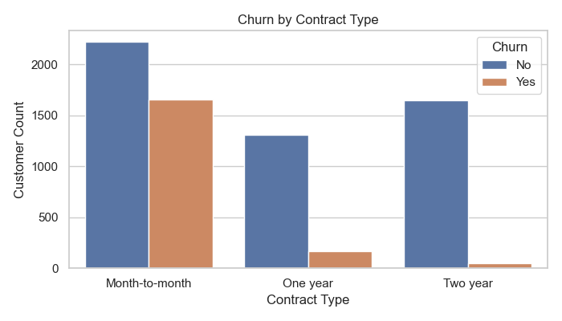
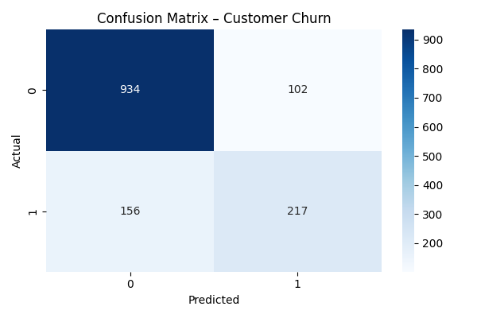
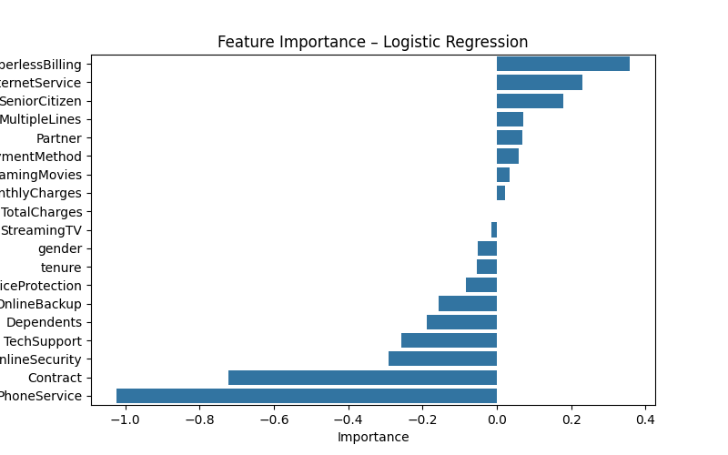

# Customer Churn Prediction

## Project Overview
This project predicts whether a telecom customer will churn using machine learning.
The goal is to understand customer behavior and identify key factors contributing to churn.

## Dataset
- Telco Customer Churn Dataset (Kaggle)
- Link: https://www.kaggle.com/datasets/blastchar/telco-customer-churn

## Tech Stack
- Python
- Pandas, NumPy
- Matplotlib, Seaborn
- Scikit-learn

## Project Structure

## Exploratory Data Analysis

### Customer Churn Distribution

### Monthly Charges vs Churn

### Churn by Contract Type

### Confusion Matrix

### Feature Importance

## Machine Learning Model
- Logistic Regression was used for churn prediction
- Model evaluated using:
  - Accuracy
  - Confusion Matrix
  - Feature Importance

